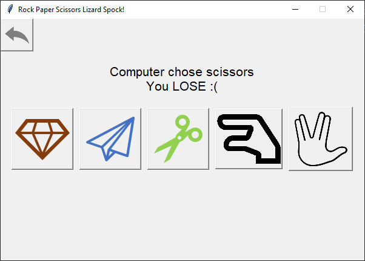

# Rock Paper Scissors Lizard Spock!

## Introduction



This is a simple implementation of the popular game from the Big Bang Theory TV show.
It is built using tkinter - a basic library for building GUI.

### Main Menu


### Running the game
The game requires no dependencies. Nevertheless, I added an environment file for you to be able to install all the libraries using anaconda.

To create a new environment from the file, simply run:

```
conda env create -f environment.yml
```

Afterwards, you can use python to run the game:

```
python game.py
```